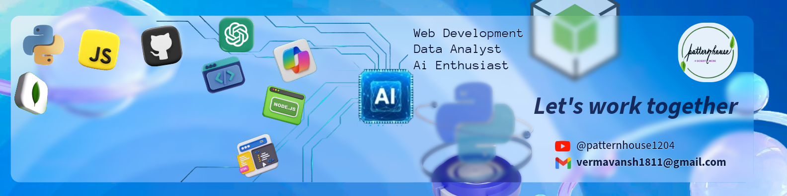

## Hi! Nice to meet you 👋

<!-- Banner (use relative path if in repo /assets/banner.png) -->

### Hi! I'm Vansh  👋
**Full Stack Developer** • **ML Engineer** • **Data Enthusiast**

- 🔭 I build web apps, ML models & data pipelines  
- 🌱 Currently pursuing dual degree BTech in Artificial Intelligence & Data Science from JECRC Foundation, Indian
- And BS Degree in Data science & Application from IIT Madras, India.
- ⚡ Fun: coffee, hiking, and experimenting with side projects

### Get in touch

---

### 🔧 Tech stack

  <!-- Example badges (replace / add languages & frameworks you use) 
    
  
  
  
  
  -->

  <!-- add/remove items -->

---

Thanks for visiting — feel free to say hi 👋

<!--
**VanshSwaroopVerma/VanshSwaroopVerma** is a ✨ _special_ ✨ repository because its `README.md` (this file) appears on your GitHub profile.

Here are some ideas to get you started:

- 👨🏻‍💻 I am Vansh, a passionate Developer based in India
-😄 Life revolves around: Design, Develop and Deployment
-🎓 Currently pursuing BTech in Artificial Intelligenece & Data Science from JECRC Foundation, India
-🎓 And also pursuing BS Degree in Data Science & Application from IIT Madras, India
-✨ Having immense love for exploring and creating tech domains
-💻 Full Stack Developer + MERN Stack
-♾️ Machine Learning Engineer / Data Engineer
-🔐 Cybersecurity Enthusiast
-
-->
